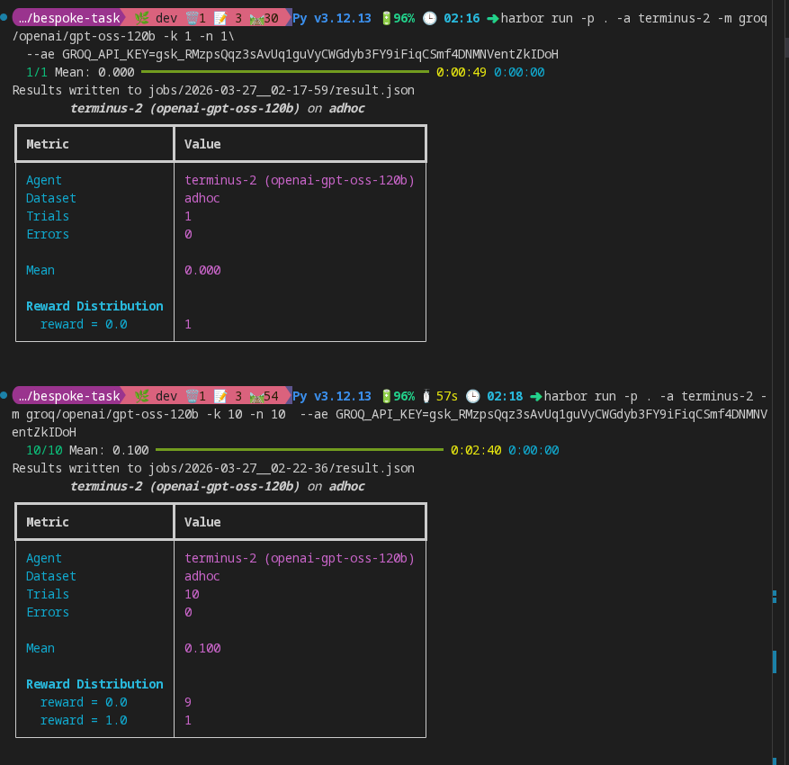

# 🚀 AI Agent DevOps Challenge (Terminal Bench 2.0)



## 📌 Description

A **Terminal Bench 2.0 "Hard" DevOps task** where an AI agent interacts with a Linux environment to debug and resolve real-world infrastructure issues.

Built using **Python, Docker, Harbor CLI, UV, and Groq API**.

---

## 🧠 Overview

This project simulates a **production-like broken system** where an AI agent must:

- Diagnose system issues
- Execute terminal commands
- Fix misconfigurations
- Validate system recovery

The task requires **multi-step reasoning and real DevOps workflows**, not trivial scripting.

---

## ⚙️ Tech Stack

- Python 3.12
- UV (Python package manager)
- Harbor CLI (Terminal Bench)
- Docker
- Groq API (LLM)
- Linux

---

## 🚀 Setup

### Install UV

```bash
curl -LsSf https://astral.sh/uv/install.sh | sh
```

### Create Environment

```bash
uv init
uv venv --python 3.12
source .venv/bin/activate
```

### Install Dependencies

```bash
uv tool install harbor
uv pip install groq
```

### Tasks initialization

```bash
harbor tasks init "task_name”
```

### Configure API Key

```bash
export GROQ_API_KEY="your_groq_api_key_here"
```

### ▶️ Run Docker Container

```bash
docker build --no-cache -t service-name -f environment/Dockerfile environment
docker run -it --rm --entrypoint /bin/bash service-name
curl https://api.groq.com/openai/v1/models \
  -H "Authorization: Bearer $GROQ_API_KEY"

```

### 🧑‍💻 Running the AI Agent

```bash
harbor run -p "./abx@xyz.com" -a oracle

harbor run -p "." -a terminus-2 --model groq/moonshotai/kimi-k2-instruct-0905 -k 1 -n 1
```

### 📊 Results

1. Single Trial Run

2. Multi-Trial Run (10 Runs)

Observed Metrics:

Trials: 10
Errors: 0
Mean Score: 0.100
Reward Distribution:
0.0 → 9 runs
1.0 → 1 run

### 🧠 How It Works

```
AI Agent
   ↓
Terminal Interface
   ↓
Dockerized Linux Environment
   ↓
Broken System State
   ↓
Agent Debugs + Fixes
   ↓
Validator → Pass / Fail
```

### 📂 Project Structure

```.
├── task/
│   ├── task.yaml
│   ├── prompt.md
│   ├── solution.sh
│   └── validator.py
│
├── environment/
│   ├── Dockerfile
│   ├── setup.sh
│   └── configs/
│
├── scripts/
│   ├── debug_tools.sh
│   └── test_cases.sh
│
├── .env
├── requirements.txt
├── README.md
└── .gitignore
```

### 🧪 Evaluation Criteria

- Correctness of solution
- Debugging capability
- Command efficiency
- Error handling
- System validation

### 📈 Key Insights

AI agents struggle with consistency across multiple runs
Requires better state tracking and reasoning
Highlights real-world challenges in autonomous DevOps debugging

### 🔐 Notes

Docker ensures reproducibility
.env is ignored (contains API keys)
Designed to prevent trivial or hardcoded solutions

### 👤 Author

Enock KIpkoech
DevOps / Backend Engineer

### License

MIT License@2026 Enock Kipkoech
